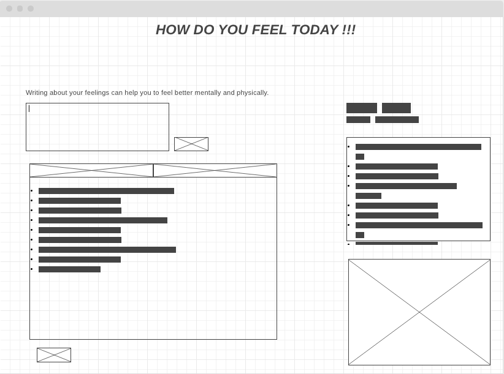

### Descriprtion :
React project that print a qoute randomly from API, and also let the user write what his/her feeling is to let them feel better when they expres thier feelings.

### User Stories :
- The User can see a todays quote which come randomly from the API.
- The User can add what he/she feel and share it.
- The User can delete what they add .
- The User can Add to the Favourite .
- The User can Edit what they add.
- The User can clear all the thing he/she add.
- The User can show all feeling.
- The User can show only the favorite.

#### The Wireframe :

### Tools :
1-javascripts .
2-React.
3-CSS .
4-BootStrap.
